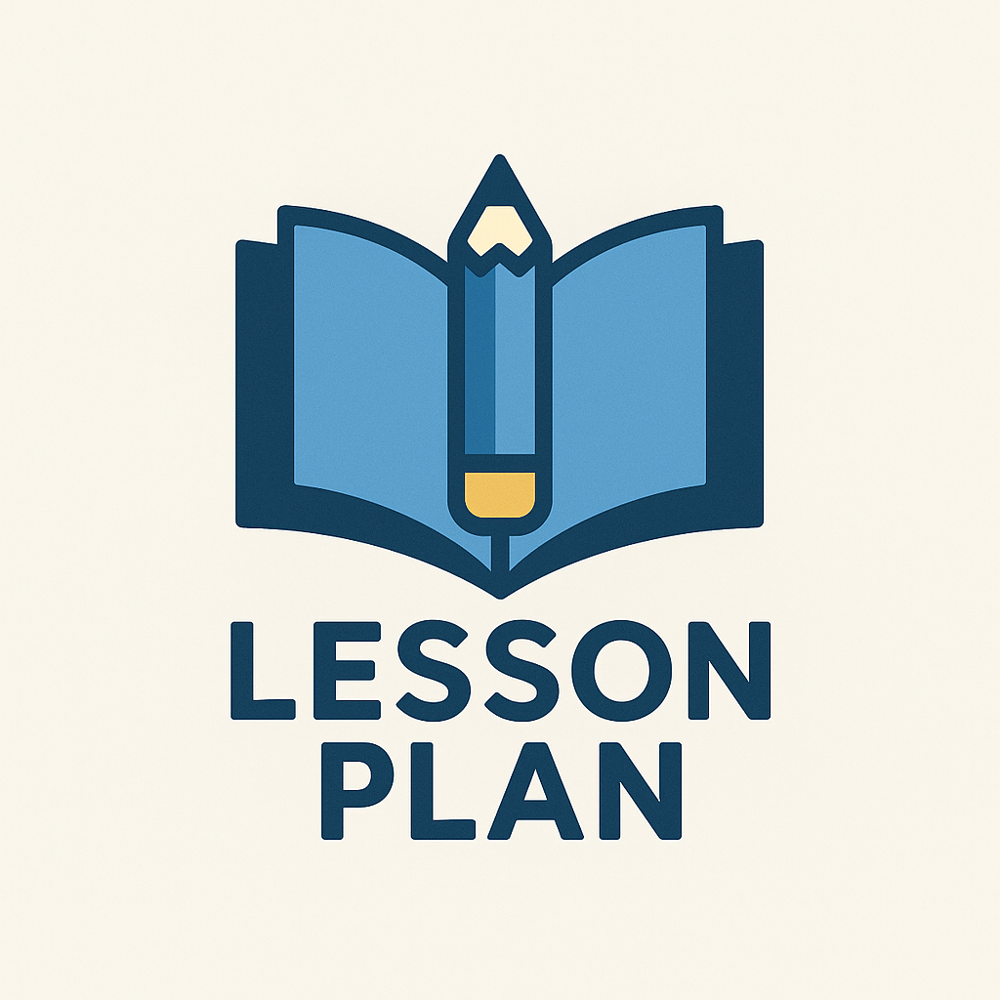
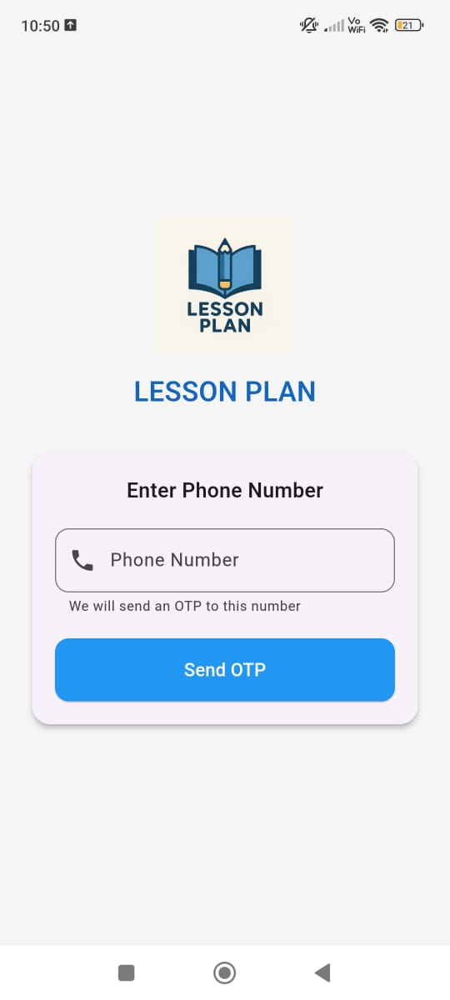

# 📘 Lesson Planner App

A modern and user-friendly Flutter app to help teachers and educators plan and manage their lessons efficiently.

---

## 🚀 Features

- 🔐 **Phone Number & OTP Login**
- 🧑‍🏫 **User-specific data** – each user sees only their added lessons
- 📝 **Add, Edit & View Lesson Plans**
- 📅 **Filter lessons by class name and date**
- 🔍 **Search functionality**
- 🧩 **Custom sections with editable bullet points**
- 🧾 **Save lesson details to Firebase Firestore**
- 📤 **Export or Share lessons as PDF (printing support)**
- 🎨 Clean and responsive UI using blue and white theme

---

## 🔧 Tech Stack

- **Flutter** (Frontend)
- **Firebase Auth** – Phone-based authentication
- **Cloud Firestore** – For storing lesson plans
- **Firebase Core**
- **PDF & Printing** packages

---

## 🖼️ Screenshots

### 🔑 Login Screen

